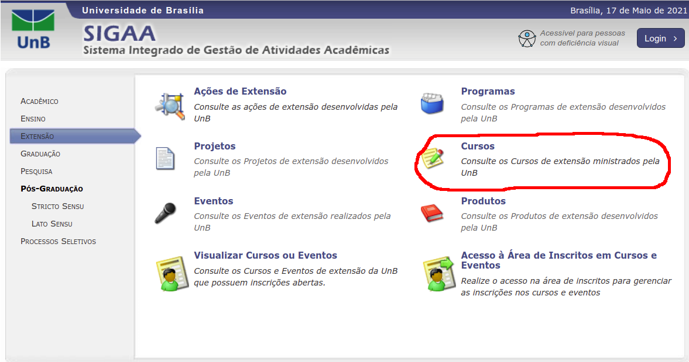
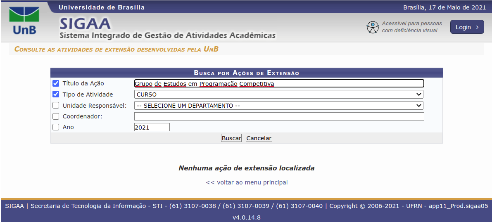
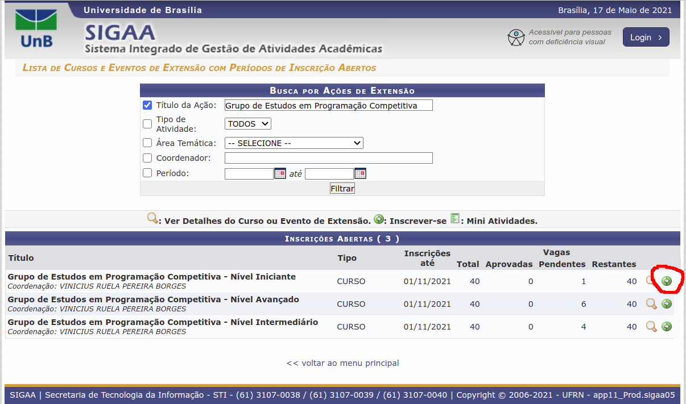

# Descrição do Projeto

Esse é um projeto de extensão desenvolvido no Distrito Federal a partir do esforço conjunto da [Universidade de Brasília](http://www.unb.br/) (campi Darcy Ribeiro e Gama) e do [Instituto Federal de Brasília](https://www.ifb.edu.br/taguatinga). Seu objetivo é incentivar o estudo da programação competitiva no DF.

As atividades do projeto são divididas em 3 grupos: iniciante, intermediário e avançado, cujas páginas são

- [Iniciante](docs/iniciante/README.md)
- [Intermediário](docs/intermediario/README.md)
- [Avançado](docs/avancado/README.md)

## Inscrições

Siga o passo-a-passo abaixo para se cadastrar em algum dos grupos de estudos em programação competitiva:

1) Se você não possui cadastro no SIGAA, faça o cadastro como visitante no SIGAA clicando [aqui](https://sig.unb.br/sigaa/public/extensao/loginCursosEventosExtensao.jsf). Ao abrir a página, clique em "Ainda não possuo cadastro!". Preencha o formulário de inscrição corretamente.

2) Escolha um dos grupos de estudos disponíveis no projeto de extensão. Informações detalhadas como o dia e horário das aulas virtuais, como também o cronograma de aulas podem ser acessados clicando nas páginas de cada grupo a seguir:

* [Nível Iniciante](https://sig.unb.br/sigaa/link/public/extensao/visualizacaoAcaoExtensao/1971) (para estudantes do Ensino Médio)
* [Nível Intermediário](https://sig.unb.br/sigaa/link/public/extensao/visualizacaoAcaoExtensao/1957) (para estudantes do Ensino Médio e do Ensino Superior)
* [Nível Avançado](https://sig.unb.br/sigaa/link/public/extensao/visualizacaoAcaoExtensao/1960) (para estudantes do Ensino Médio e do Ensino Superior)

3) Faça o login no SIGAA clicando [aqui](https://sig.unb.br/sigaa/public/extensao/loginCursosEventosExtensao.jsf) e insira corretamente as suas credenciais.
 
4) A partir da sua tela inicial, clique na aba "Extensão", depois em "Cursos":

5) No formulário de busca, digite "Grupo de Estudos em Programação Competitiva" (sem aspas duplas no campo), levando-o a obter a seguinte tela:

6) Os três grupos de estudos irão aparecer na tela. Inscreva-se clicando na seta verde associada ao grupo de sua escolha: 

5) Preencha corretamente o formulário de inscrição. Após o preenchimento e solicitação de inscrição, aguarde o contato da equipe do grupo de estudos para os próximos passos.

